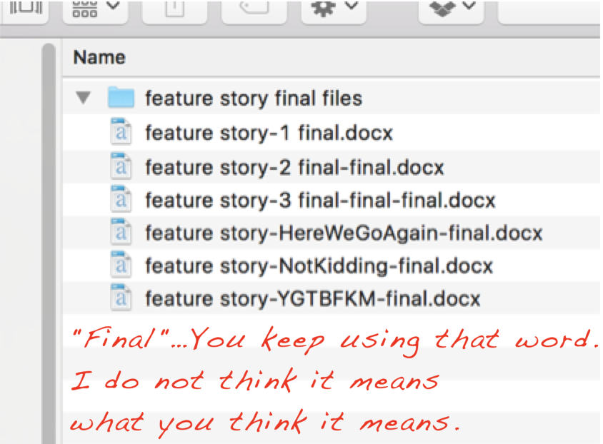
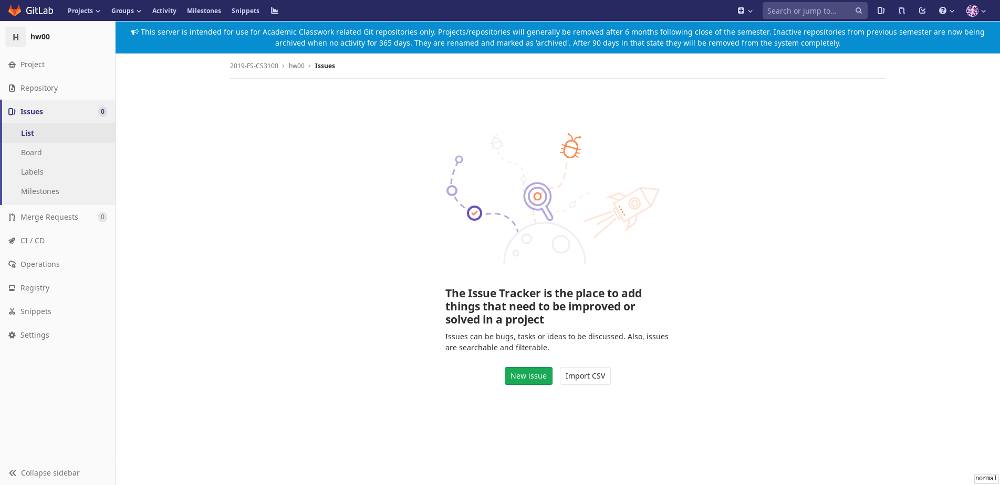
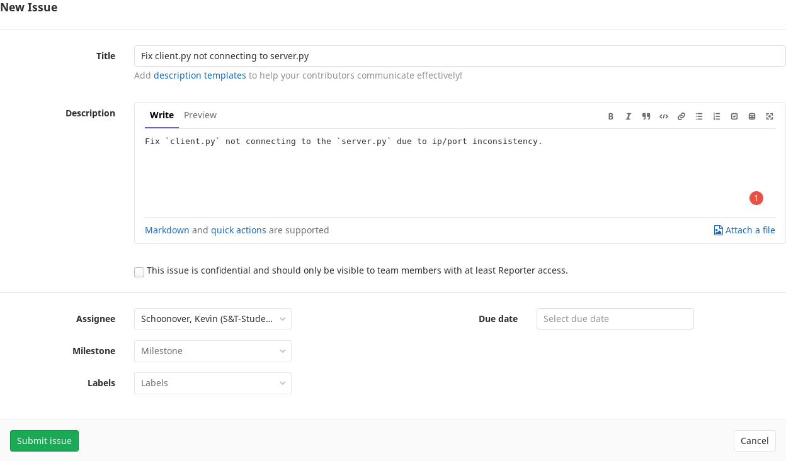
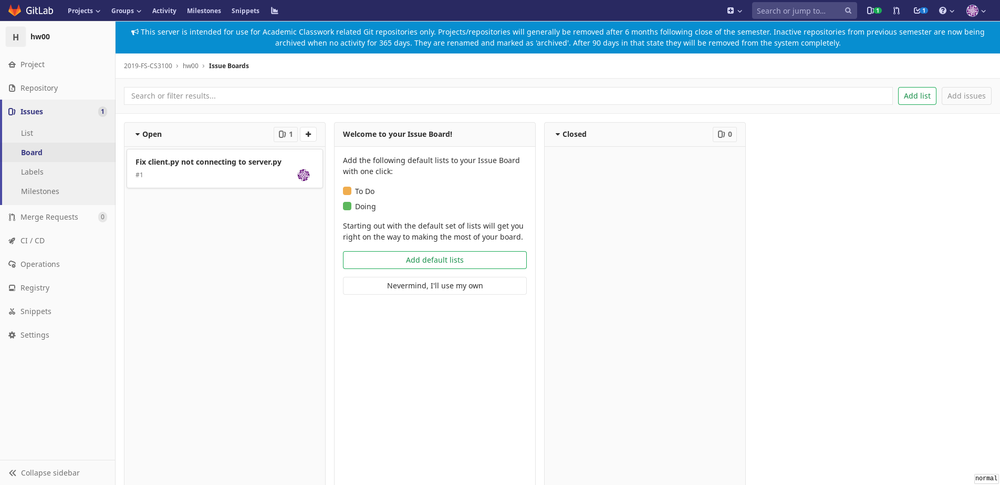
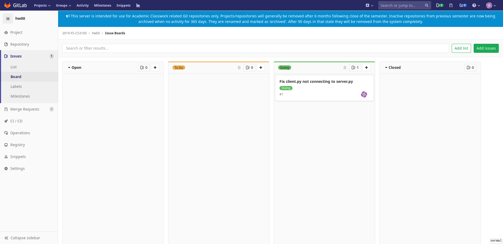
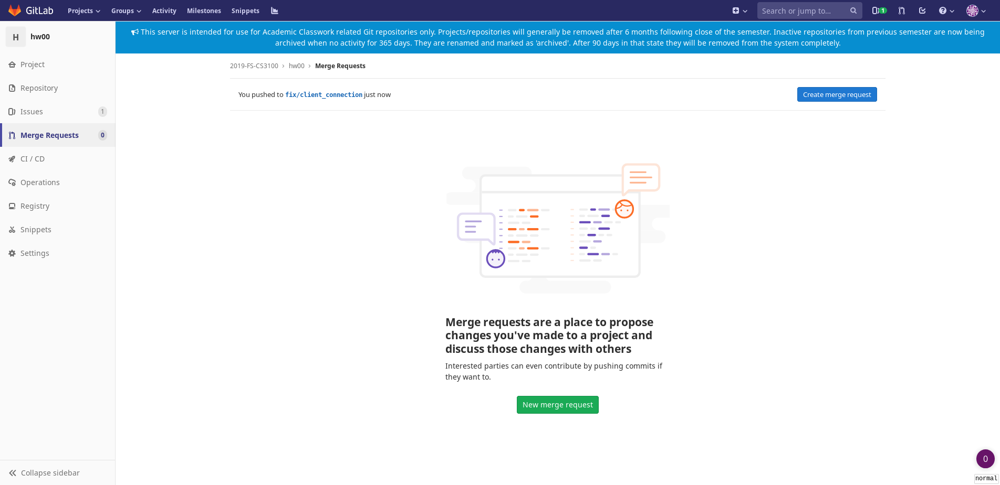
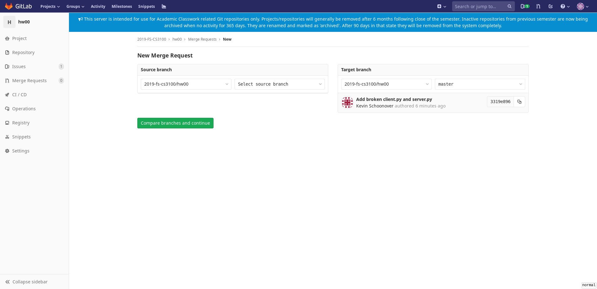
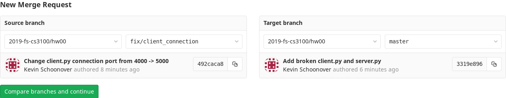
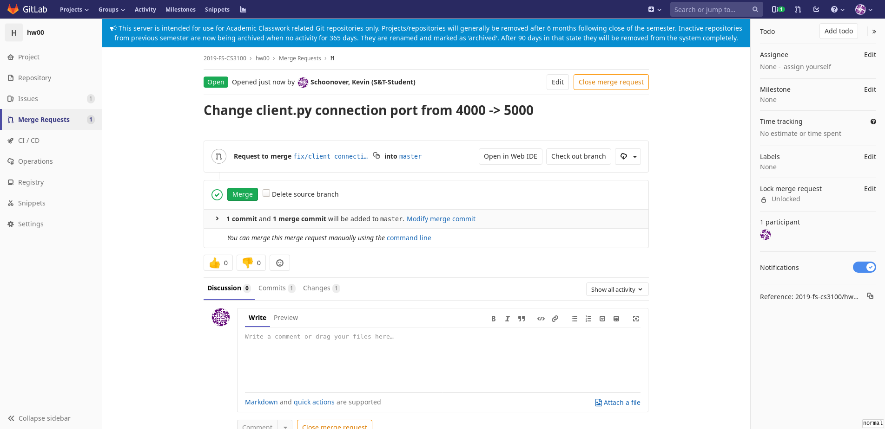

# CS3100 Homework 0 - Agile GitLab
Hello Developer,

This assignment is due on **Friday, September 13th at 11:59.59 pm**.

My name is Kevin Schoonover (ksyh3@mst.edu for questions or homework problems)
and I am the CEO of a new startup (your grader), gos.ly. We are so excited you
have decided to join us. I wanted to send you a personal note to welcome you to
our company and to provide your first assignment! You mentioned in your resume
how much you loved mandatory HR training so we decided to provide you with some.

gos.ly uses the hottest new software development method, Agile, which you
will learn more about at your time in the company. However, we would not be a
startup without putting our own special spin on it. The first training will act as an
introduction to gos.ly's Agile method that you may choose to use on your
project, show you around git, and have you practice with cool features of
GitLab.

Without further ado, lets get started!

## Git
**NOTE**: if you are familiar with git, please feel free to skip
this section.

Git is a free, open-source, distributed version control system developed by
Linus Torvalds (creator of Linux) that has become incredibly popular over the
years. It has many advanced features, but we are only going to look at an
important subset. Please look at the resources mentioned below if you want to
know more; they are very comprehensive and were very helpful when I initially
learned git.

References:
+ **Official Documentation** - https://git-scm.com/doc
+ **'Official' Git Book** - https://git-scm.com/book/en/v2
+ **Git Resources** - https://try.GitHub.io/

### Version Control?
Has this ever happened to you (1570 project I am looking at you)?



The picture above is actually a kind of version control (while not particularly
featureful or easy to use). Version control is defined according to the
'official' git book as:
> a system that records changes to a file or set of files over time so that
> you can recall specific versions later.

This concept is particularly important when developing code as you may
overtime change your code in a way that breaks it fundamentally. Without
version control, a problem like that is unrecoverable without having your
`Ctrl+Z` handy and a few hours of wondering why you majored in
computer science. However, if you used version control properly, you simply
need to revert to the last working version, saving you many hours of
debugging.

References:
+ **Gettings Started - About Version Control** - https://git-scm.com/book/en/v2/Getting-Started-About-Version-Control


### How Does Git Work?
Please read the
[What is Git](https://git-scm.com/book/en/v2/Getting-Started-What-is-Git%3F)
chapter in the 'official' git book. Pay special attention to the `The Three
States` section as it is fundamental to how git thinks about files

The high level is:
+ Git tracks changes to files by taking snapshots of an entire repository (like
  a directory) at a time. You can think of this a lot like the picture
  above. Git saves the exact copy of a repository (directory) state at a given
  time and we can then revert back to a previous version if we have a problem
  because we have all previous copies.
+ Git will only track files if you explicitly tell it to. If you choose to
  track a file, git will indentify it as:
    - `modified` - The file has been changed since the last 'snapshot'.
    - `staged` - You have told git to store the modifications when you take the next 'snapshot'.
    - `committed` - The file has been safely stored in a 'snapshot' locally.

#### Git vs GitLab and GitHub
When employees first learn about git, they often believe that git, GitLab, and
GitHub are the same thing. Git describes the protocol/implementation by which
one manages a repository while GitLab and GitHub are an implementations of a
[git server](https://git-scm.com/book/en/v2/Git-on-the-Server-The-Protocols)
which can remotely store git repositories. It is a very nuanced difference, but
'{GitHub, GitLab}' and 'git' are not the same term.

### Installing Git
Please follow the instructions at
https://git-scm.com/book/en/v2/Getting-Started-Installing-Git to install git
locally on your machine. If you are on windows, I would recommend installing
[Github Desktop](https://desktop.GitHub.com/) as it is usually the most
consistent installation experience, but the instructions in the book may be
more intuitive.

### Git 101
This section will discuss basic management of a repository.

#### Creating a repository
A repository is the fundamental building block of git that tracks all
changes you make to files in your project by building a history over time.
This is done with fairly complex datastructures, but if you are interested
you can find more information at
https://git-scm.com/book/en/v2/Git-Internals-Plumbing-and-Porcelain. For now,
just think of this as a magical black box that keeps track of your changes
and allows you to perform all of the actions we will talk about later.

To start a repository, create a directory with whatever name you want, enter
that directory with your terminal, and run:
```bash
git init
```

The directory you created will now contain a `.git/` folder. The `.git/`
folder is what makes the directory a git repository: it contains all of the
nice data structures and index files necessary for git to keep snapshots. Whenever you perform any git command (which we will discuss later), a `.git/` folder must be in your current directory or a parent directory; otherwise, you will see:
```
fatal: not a git repository (or any of the parent directories): .git
```

**NEVER** delete or modify the `.git/` folder directory or you will lose all of your changes.

#### Adding files to the local repository
In the new repository, create a file called `README.md` with the following
content:
```
gos.ly is the best company ever created. I love working here.
```

If you run `git status`, it should look something like:
```bash
>>> git status
On branch master

No commits yet

Untracked files:
  (use "git add <file>..." to include in what will be committed)
	README.md

nothing added to commit but untracked files present (use "git add" to track)
```

`git status` allows you to view the current state of all the files in
your repository. You can see the README.md is marked as untracked so we need
to tell git to explicitly track changes to README.md. To do that,
we need to run:
```bash
git add README.md
```

If you run `git status` now, it will look like:
```bash
>>> git status
On branch master

No commits yet

Changes to be committed:
  (use "git rm --cached <file>..." to unstage)
	new file:   README.md
```

The README.md is now staged which means that it will be saved in the next
snapshot. To create a snapshot with all of the current committed files, run
`git commit`:
```bash
>>> git commit

# Please enter the commit message for your changes. Lines starting
# with '#' will be ignored, and an empty message aborts the commit.
#
# On branch master
#
# Initial commit
#
# Changes to be committed:
#       new file:   README.md
````

You will then be prompted to add a commit message. Commit messages tell
future collaborators or you what you accomplished in the commit. If three
months later you have added many more features and need to revert to a
previous snapshot, the commit messages will tell you what to revert to.

Add whatever commit message you think is appropriate, save the file, and then
exit.

If you run `git status` now, you should see:
```bash
>>> git status
On branch master
nothing to commit, working tree clean
```
since everything is now in the committed state. The file is now added to
the repository.


Make a few more commits to the repository by modifying, adding, or removing files.

#### Viewing Commit History
I have shown you how to create snapshots, but how do you view all of the
snapshots you have made? The solution is `git log`:
```bash
>>> git log
commit 1b35fbb8afb9c73baae4c3fda30a038088aec77a (HEAD -> master)
Author: Kevin Schoonover <schoonoverkevinm@gmail.com>
Date:   Thu Aug 22 16:31:42 2019 -0500

    Change my mind and added README.md back

commit 21ceb7cf9b66371b625ed6f1139278de5d7e2ac6
Author: Kevin Schoonover <schoonoverkevinm@gmail.com>
Date:   Thu Aug 22 16:31:27 2019 -0500

    Removed README.md

commit 2ab9a4a549282574171ae70eb03ff57be83f19d0
Author: Kevin Schoonover <schoonoverkevinm@gmail.com>
Date:   Thu Aug 22 16:08:56 2019 -0500

    Wow, this tutorial is so great
```

#### Pushing changes to a remote repository
You initialized the test repository above using `git init` so there will be
no remote repository; however, most environments will have you downloading
(known as cloning) a repository from GitHub, GitLab, etc. so that multiple
people can work on it together. This would look like:
```bash
>> git clone <remote_repository_url>
... make some changes to the repository
>> git commit
>> git push origin master
```

`origin` specifies the url for the remote repository 'origin'. You can see
your current remotes by using:
```bash
>>> git remote -v
origin	git@git-classes.mst.edu:2019-fs-cs3100/hw00.git (fetch)
origin	git@git-classes.mst.edu:2019-fs-cs3100/hw00.git (push)
```

The remote repository will only be updated when you run `git push` so make
sure you push your changes regularly. If someone else runs `git push`, you
must run `git pull` to fetch the latest changes from the repository.

#### Branching
Branching is one of git's most fundamental concepts as you will see it
everywhere in a production environment. Branches allow you to work on
features, a particular part of the code, or experiment without changing the
'main line' that everyone else is working off of.

Lets review the output of `git status`:
```bash
>>> git status
On branch master
nothing to commit, working tree clean
```

Notice the `On branch master` on the first line. By default, everyone works
on the `master` branch; therefore, whenever you make a change and commit it,
you could potentially be messing with someone elses code.

To create a new branch, run `git checkout -b <branch_name>`:
```bash
>>> git checkout -b test
Switched to a new branch 'test'
```

If you want to switch between branches, run `git checkout <branch_name>`:
```bash
>>> git checkout test
Switched to branch 'test'
>>> git checkout master
Switched to branch 'master'
```

Any change you make on this new branch will now only exist on `test`, but you
will eventually need this feature to end up on `master` for production. To
solve this, git will allow you to merge all changes from two branches
together. The syntax looks like:
```bash
# Starting in branch 'test'
>>> git checkout master
Switched to branch 'master'
>>> git merge test
```
The semantics are 'I want to merge branch B into Branch A'
where branch B is `test` and branch A is `master`.


##### Merge Conflicts
What happens if you and someone else both make a change to the same piece of
code? Git's solution to this problem is called a merge conflict. You can
read a lot more about merge conflicts at https://www.atlassian.com/git/tutorials/using-branches/merge-conflicts,
but the gist is that Git will annotate places in the file that it identifies a
merge conflict in and force you to resolve it.

## The Training
Now that you are a git expert, it's time to learn how to use gos.ly's agile
method with an assignment. **NOTE**: I will be auto grading this so try to be
careful with using the exact same output/commands.

### Step 1 - Creating an Issue
GitLab allows developers to create 'issues' associated with their
repositories. We at gos.ly use issues for feature and bug tracking. This
allows us to publicly document a feature we want to add, have discussions
about feature implementations, and assign particular developers to
work on problems/features.

To create an issue:
1. Navigate to GitLab's sidebar and click on 'issues'. You should see:
  
2. Click the 'new issue' button.
3. Create an issue that looks like:
   where:
    + Title = 'Fix client.py not connecting to server.py'
    + Description = 'Fix \`client.py\` not connecting to the \`server.py\` due to
      ip/port inconsistency.'
    + Assignee = <your_user>

You now have your first task, let's complete it.

## Step 2 - Adding the issue to the board
GitLab boards are useful for scheduling and organizing issues into their current
status. Our agile method keeps track of all issues in 3 primary states:
1. `todo` - tasks that haven't been started, but need to be completed
2. `in progress` - tasks that are currently being worked on
3. `done` - tasks that are completed

We should add your issue in the `in progress` section of the board to designate
that you are currently working on it:
1. Click the 'Board' menu under issues which should show:
  
2. Add the default lists by clicking the 'Add default lists' button and move the
   issue in the 'Doing' section:
  

Now let us take a look at the issue.

## Step 3 - Fixing the issue
Let us take a look as to why client.py and server.py cannot connect to one
another.

First, create a new branch called `fix/client_connection` so that we don't
edit master at the same time as someone else.

Then, in your new branch, open two terminals in the git repository and run
in order:
1. Terminal 1 - `python3 server.py`
2. Terminal 2 - `python3 client.py`

In terminal 1, you should see:
```bash
>>> python3 server.py
Listening on localhost:5000
# After 10 seconds
Failed due to timeout! Start me again!
```

In terminal 2, you should see:
```bash
>>> python3 client.py
Connecting to server at localhost:4000
Failed to connect to the server! Is it started? Have you changed the port?
```

Looking at the first line of each terminal we see `Listening on
localhost:5000` and  `Connecting to server at localhost:4000`. It seems there
is a `ip:port` mismatch so edit the `client.py` to use the correct port.

Test your changes by running the commands again, you should see:
+ Terminal 1:
  ```bash
  >>> python3 server.py
  Listening on localhost:5000
  Success!
  ```
+ Terminal 2:
  ```bash
  >>> python3 client.py
  Connecting to server at localhost:5000
  Success!
  ```

Make sure to commit and push your code onto the remote branch by using:
```bash
>>> git commit
>>> git push origin fix/client_connection
```

Now that you have successfully solved the issue, you should submit your
changes in a pull request.
## Step 4 - Merging your changes with a pull request
Pull requests are ordinarily used so other developers can review
your code before being merged into master, preventing bad code from entering
production.

You are the only developer in your project so you will be reviewing your own
code. To create a pull request with your branch, perform the
following steps:
1. Click the 'Merge Request' menu on the left of GitLab. The result should
   look like:
   
2. Click 'new merge request' near the buttom of the page. The result should look
   like:
   
3. The `source branch` is the branch you wish to merge into the `target branch`,
   set the `source branch` to `fix/client_connection` (if you do not see this,
   make sure you created and/or pushed the changes on that branch):
   .
4. Click 'compare branches and continue'
5. Make sure everything looks okay on the screen i.e. add a title or change the
   description if you want (you shouldn't have to change anything) and click
   'submit merge request'.
6. Open the Merge Request by clicking 'Merge Requests' -> the only merge request:
  
7. Review your code and click on `Merge` when you're ready to go. **DO NOT**
   delete the source branch as I will be checking that it exists in the auto
   grader (this should be fine by default).


## Step 5 - Finishing up
Now that we are done, we need to make sure to close the issue in `issues` and
move the issue in our board to `closed`. When you close the issue, it should
automatically move it to `closed`, but check to make sure.

Figuring out these two steps will be left as an exercise for the reader.

## Bonus
As a little fun for advanced git users, see if you can squash all of my
commits I used to setup the assignment into one commit. I would be careful
with this as it could potentially mess up your git tree, but for the brave of
heart extra resources can be found at
https://git-scm.com/book/en/v2/Git-Tools-Rewriting-History. Master is a
protected branch so it may not allow you to do this on master. Try using a
branch called 'bonus' and I'll check to see if it is there.
